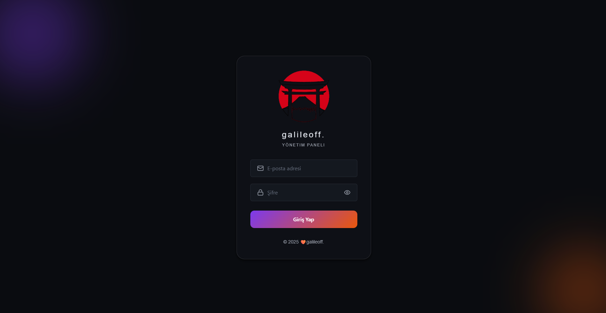
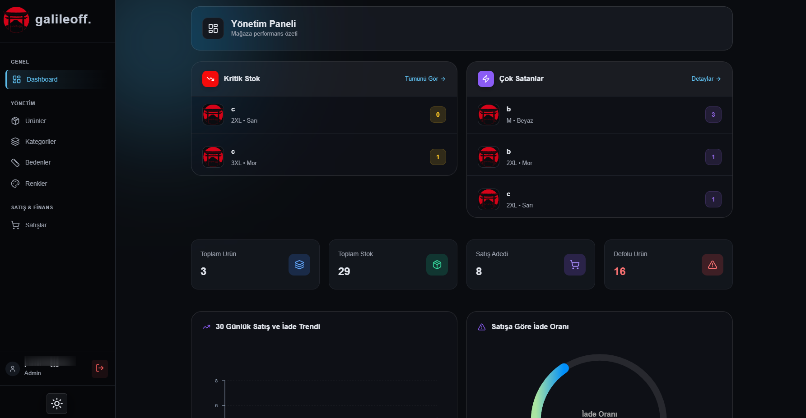
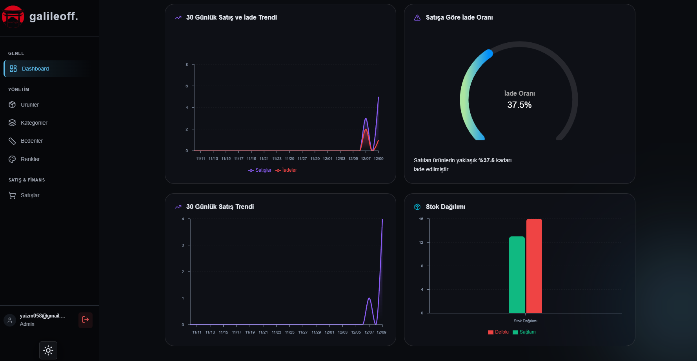
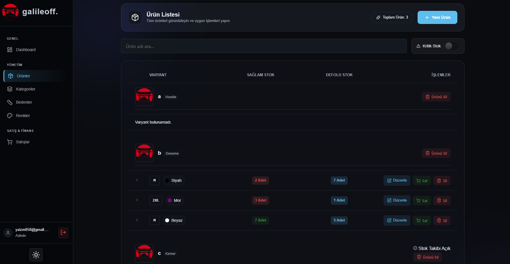
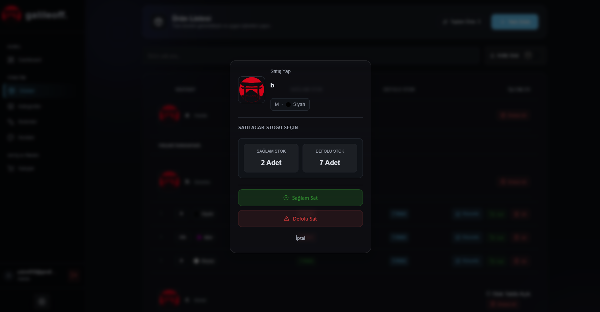
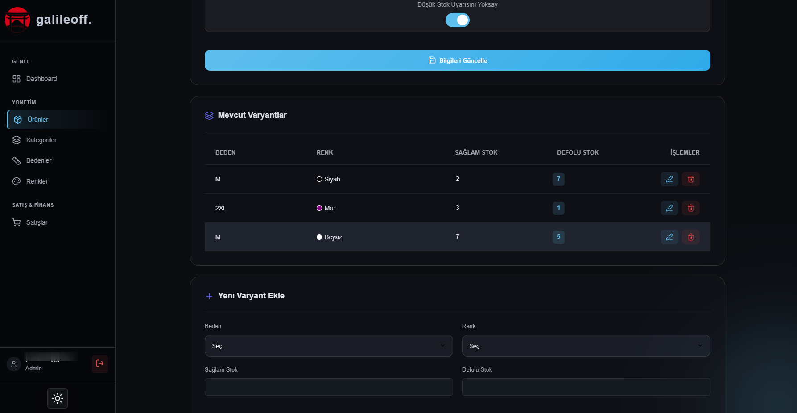
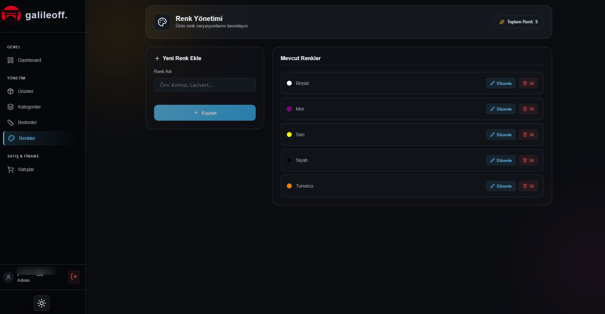
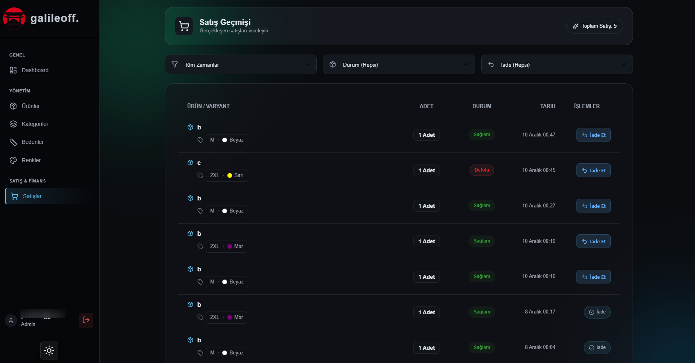

<div align="center">
  
  <h1>Galileoff Stock Control Panel</h1>
  <p><strong>Gelişmiş Giyim Stok ve Satış Yönetim Paneli</strong></p>
</div>

<div align="center">


</div>

<p align="center">
  Modern ve hızlı bir web paneli ile ürünlerinizi, stoklarınızı, satışlarınızı ve iadelerinizi yönetin. Dashboard üzerinden kritik stok seviyelerini, en çok satan ürünleri ve satış performansını anlık olarak takip edin.
</p>

---

## 📋 İçindekiler

> [!İçindekiler]
> - [🖼️ Proje Galerisi](#️-proje-galerisi)
> - [✨ Temel Özellikler](#-temel-özellikler)
> - [🏗️ Teknik Mimari](#️-teknik-mimari)
> - [💻 Teknoloji Yığını](#-teknoloji-yığını)
> - [🚀 Yerelde Çalıştırma](#-yerelde-çalıştırma)
> - [🗂️ Proje Yapısı](#️-proje-yapısı)
> - [📄 API Uç Noktaları](#-api-uç-noktaları)
> - [🤝 Katkıda Bulunma](#-katkıda-bulunma)
> - [☕ Destek Olun](#-destek-olun)
> - [📝 Lisans](#-lisans)

---

## 🖼️ Proje Galerisi
<div align="center">
<details>
  <summary>Giriş Sayfası</summary>
  <br>
  <table>
    <tr>
      <td></td>
    </tr>
  </table>
</details>
<details>
  <summary>Dashboard</summary>
  <br>
  <table>
    <tr>
      <td></td>
      <td></td>
    </tr>
  </table>
</details>
<details>
  <summary>Ürünler Sayfası</summary>
  <br>
  <table>
    <tr>
      <td></td>
      <td></td>
      <td></td>
    </tr>
  </table>
</details>
<details>
  <summary>Renk Ekleme</summary>
  <br>
  <table>
    <tr>
      <td></td>
    </tr>
  </table>
</details>
<details>
  <summary>Satışlar Sayfası</summary>
  <br>
  <table>
    <tr>
      <td></td>
    </tr>
  </table>
</details>
</div>

---

## ✨ Temel Özellikler
-   **📦 Kapsamlı Ürün Yönetimi:** Ürünleri fotoğraf, kategori, tedarikçi, alış fiyatı, satış fiyatı, sağlam/defolu stok adedi gibi zengin detaylarla yönetin.
-   **🎨 Sınırsız Varyasyon:** Projenize özel sınırsız sayıda Kategori, Renk ve Beden tanımlayın ve bunları ürünlerle ilişkilendirin.
-   **📈 Akıllı Satış ve İade Takibi:** Yapılan satışları ve iadeleri kaydederek stok durumunu anlık ve otomatik olarak güncelleyin.
-   **📊 Gelişmiş Dashboard:**
    -   **Kritik Stok Uyarıları:** Stoğu azalan ürünleri anında tespit edin.
    -   **En Çok Satanlar:** Performanslarına göre en popüler ürünleri ve kategorileri listeleyin.
    -   **Finansal Analiz:** Toplam satış geliri, iade maliyetleri ve potansiyel kâr gibi metrikleri izleyin.
    -   **Görsel Raporlar:** Satış trendleri, stok dağılımı gibi verileri interaktif grafiklerle analiz edin.
-   **🔐 Güvenli Kimlik Doğrulama:** Supabase Auth ile modern ve güvenli kullanıcı girişi. Rol tabanlı yetkilendirme ile yönetim paneline sadece adminler erişebilir.
-   **🌙 Modern ve Duyarlı Arayüz:** Kullanıcı tercihine göre Açık ve Koyu Tema desteği sunan, tüm cihazlarla uyumlu (responsive) minimalist tasarım.

---

## 🏗️ Teknik Mimari
Bu proje, modern web geliştirme standartlarına uygun, ölçeklenebilir ve bakımı kolay bir mimari üzerine inşa edilmiştir.

```
┌───────────────────┐       ┌─────────────────────────┐      ┌────────────────────────┐
│ İstemci (Browser) │ ────▶ │ Next.js (Web Sunucusu) │ ────▶│   Supabase (Backend)   │
│ (React Components)│       │       (API Routes)      │      │    (PostgreSQL DB)     │
└───────────────────┘       └─────────────────────────┘      └────────────────────────┘
         │                          │                          ▲
         │                          │                          │
         └──────────────────────────▼──────────────────────────┘
                  (SWR ile Veri Çekme ve Önbellekleme)
```

---

## 💻 Teknoloji Yığını
| Katman | Teknoloji | Açıklama |
| :--- | :--- | :--- |
| **Framework** | **Next.js 13** | React tabanlı, sunucu taraflı render ve statik site oluşturma. |
| **Dil** | **TypeScript** | Büyük projelerde tip güvenliği ve daha kolay bakım sağlar. |
| **Veritabanı & Backend** | **Supabase** | PostgreSQL, Auth, Storage ve anlık API'ler sunan açık kaynaklı Firebase alternatifi. |
| **Veri Çekme** | **SWR** | Vercel tarafından geliştirilen, yeniden doğrulama stratejisine sahip data-fetching kütüphanesi. |
| **Grafik & Raporlama**| **Recharts, ApexCharts**| İnteraktif ve özelleştirilebilir grafik bileşenleri. |
| **Form Yönetimi** | **React Hook Form**| Performanslı ve esnek form doğrulama ve yönetimi. |
| **UI & İkonlar** | **CSS Modules, Lucide** | Bileşen bazlı stil yönetimi ve hafif, özelleştirilebilir ikonlar. |

---

## 🚀 Yerelde Çalıştırma

### Adım 1: Projeyi Klonlayın
```bash
git clone https://github.com/galile0ff/galileoff-StockControlPanel.git
cd galileoff-StockControlPanel
```

### Adım 2: Supabase Projesini Ayarlayın
Projenin çalışması için bir Supabase projesine ihtiyacınız var.
1. [Supabase](https://supabase.com/)'e kaydolun ve yeni bir proje oluşturun.
2. Proje panelindeki **SQL Editor**'e gidin.
3. `supabase_schema.sql` dosyasının içeriğini kopyalayıp çalıştırın.
4. `supabase_storage_policies.sql` içeriğini de aynı şekilde çalıştırın.
5. **Settings > API** bölümünden `Project URL`, `anon public` Key ve `service_role` Secret Key'i kopyalayın.

### Adım 3: Ortam Değişkenlerini Oluşturun

<summary>👉 Proje kök dizininde <code>.env.local</code> adında bir dosya oluşturun ve içeriğini kopyalayın.</summary>

```bash
# Genel istemci tarafı erişim için
NEXT_PUBLIC_SUPABASE_URL=[SUPABASE_PROJE_URL'İNİZ]
NEXT_PUBLIC_SUPABASE_ANON_KEY=[SUPABASE_ANON_KEY'İNİZ]

# API rotalarında yönetici işlemleri (ürün ekleme, silme vb.) için
# Bu anahtarın dışarı sızdırılmamasına özellikle dikkat edin!
SUPABASE_SERVICE_ROLE_KEY=[SUPABASE_SERVICE_ROLE_KEY'İNİZ]
```

### Adım 4: Bağımlılıkları Yükleyin ve Çalıştırın
```bash
npm install
npm run dev
```
Uygulama artık [http://localhost:3000](http://localhost:3000) adresinde çalışmaya hazır!

---

## 🗂️ Proje Yapısı

<summary>👉 Projenin detaylı dosya ve klasör yapısı.</summary>

```
/

├── .gitignore
├── middleware.ts               # Next.js middleware (örn: kimlik doğrulama yönlendirmeleri)
├── next-env.d.ts               # Next.js için TypeScript tip tanımlamaları
├── package.json                # Proje bağımlılıkları ve script'leri
├── README.md                   # Bu dosya
├── supabase_schema.sql         # Supabase veritabanı şeması, tablolar ve RLS poliçeleri
├── supabase_storage_policies.sql # Supabase depolama güvenlik kuralları
├── tsconfig.json               # TypeScript derleyici ayarları
├── public/
│   └── assets/
│       └── logo.svg            # Site logosu
└── src/
    ├── components/             # Tekrar kullanılabilir React bileşenleri (Formlar, Listeler vb.)
    │   ├── CategoryForm.tsx
    │   ├── Layout.tsx
    │   ├── ProductForm.tsx
    │   └── ...
    ├── context/                # React Context API sağlayıcıları (örn: Tema Yönetimi)
    │   └── ThemeContext.tsx
    ├── lib/                    # Yardımcı fonksiyonlar ve kütüphane ayarları
    │   └── supabaseClient.ts   # Supabase istemci bağlantı konfigürasyonu
    ├── pages/                  # Uygulama sayfaları ve API rotaları
    │   ├── _app.tsx              # Global App bileşeni
    │   ├── index.tsx             # Ana Dashboard sayfası
    │   ├── login.tsx             # Giriş sayfası
    │   ├── api/                  # Backend API uç noktaları
    │   │   ├── categories.ts
    │   │   ├── products.ts
    │   │   └── ...
    │   └── manage/               # Ürün, kategori vb. yönetim sayfaları
    │       ├── products.tsx
    │       └── ...
    └── styles/                 # Global ve modüler CSS dosyaları
        ├── globals.css
        └── Dashboard.module.css
```


---

## 📄 API Uç Noktaları

| Metot | Endpoint | Açıklama |
| :--- | :--- | :--- |
| `GET, POST, PUT, DELETE` | `/api/products` | Ürünleri ve ürün varyantlarını yönetir. |
| `GET, POST, PUT, DELETE` | `/api/categories` | Kategorileri yönetir. |
| `GET, POST, PUT, DELETE` | `/api/colors` | Renkleri yönetir. |
| `GET, POST, PUT, DELETE` | `/api/sizes` | Bedenleri yönetir. |
| `GET, POST` | `/api/sales` | Satış kayıtlarını listeler ve oluşturur. |
| `GET, POST` | `/api/returns` | İade kayıtlarını listeler ve oluşturur. |
| `GET` | `/api/dashboard-stats` | Dashboard için tüm istatistiksel verileri toplar. |


<summary>👉 Örnek API İstek Body'leri.</summary>

#### `POST /api/products`
Yeni bir ürün ve varyantları oluşturur.
```json
{
  "name": "Yeni Sezon T-Shirt",
  "code": "TSH-001",
  "categoryId": "c5a6b7d8-e9f0-1234-5678-9abcdef01234",
  "variants": [
    { "sizeId": "s1...", "colorId": "c1...", "stock": 10, "isDefective": 0 },
    { "sizeId": "s2...", "colorId": "c1...", "stock": 5, "isDefective": 1 }
  ]
}
```

#### `PUT /api/products`
Mevcut bir ürünün bilgilerini veya varyantlarını günceller.
```json
{
  "productId": "p1...",
  "name": "Güncellenmiş T-Shirt Adı",
  "variantsToAdd": [
    { "sizeId": "s3...", "colorId": "c2...", "stock": 20, "isDefective": 0 }
  ],
  "variantsToUpdate": [
    { "id": "pv1...", "stock": 8, "isDefective": 1 }
  ],
  "variantsToDelete": [
    "pv2..."
  ]
}
```

#### `POST /api/sales`
Yeni bir satış kaydeder. Stoklar otomatik olarak düşülür.
```json
{
  "items": [
    { "variantId": "pv1...", "quantity": 2 },
    { "variantId": "pv2...", "quantity": 1 }
  ]
}
```

#### `POST /api/returns`
Bir iade kaydeder. Stoklar otomatik olarak güncellenir.
```json
{
  "items": [
    { "variantId": "pv1...", "quantity": 1, "isDefective": true },
    { "variantId": "pv2...", "quantity": 1, "isDefective": false }
  ]
}
```


---

## 🤝 Katkıda Bulunma

Katkılarınız projeyi daha iyi hale getirecektir! Lütfen `CONTRIBUTING.md` dosyasını inceleyin.

1.  Bu repoyu fork'layın.
2.  Yeni bir özellik dalı oluşturun (`git checkout -b feature/yeni-ozellik`).
3.  Değişikliklerinizi commit'leyin (`git commit -m 'feat: Yeni bir özellik eklendi'`).
4.  Dalınızı push'layın (`git push origin feature/yeni-ozellik`).
5.  Bir Pull Request açın.

---

## ☕ Destek Olun
<p align="center">
Bu proje işinize yaradıysa ve geliştirmemi desteklemek istiyorsanız, bana bir kahve ısmarlayabilirsiniz!
<br><br>
<script type="text/javascript" src="https://cdnjs.buymeacoffee.com/1.0.0/button.prod.min.js" data-name="bmc-button" data-slug="galileoff" data-color="#FF5F5F" data-emoji="☕" data-font="Lato" data-text="Buy me a coffee" data-outline-color="#000000" data-font-color="#ffffff" data-coffee-color="#FFDD00" ></script>
</p>

---

## 📝 Lisans
<p align="center">
Bu proje <a href="LICENSE">MIT</a> lisansı ile lisanslanmıştır.
</p>